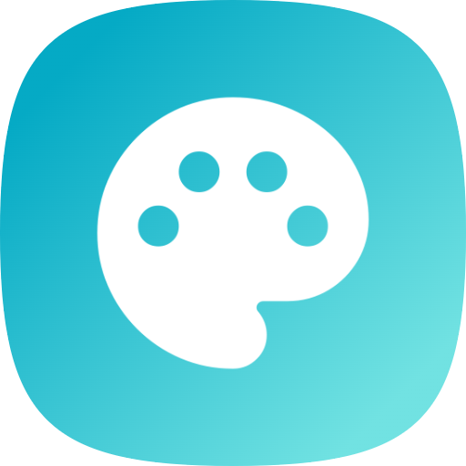

# Nostr Chat NDK

A modern, decentralized chat application built with Next.js and Nostr protocol, enabling censorship-resistant messaging through the Nostr network.



## 🚀 Features

- **Decentralized Messaging**: Built on the Nostr protocol for censorship-resistant communication
- **Real-time Chat**: Live message updates using Nostr relays
- **Channel Support**: Create and join different chat channels
- **User Profiles**: View and manage Nostr profiles with metadata
- **Favorites System**: Save and quickly access your favorite channels
- **Unread Messages**: Track unread messages across channels
- **Lightning Integration**: Support for Lightning Network payments (bolt11)
- **Responsive Design**: Works seamlessly on desktop and mobile devices
- **Dark Mode**: Built-in theme support with light/dark mode toggle
- **Virtualized Lists**: Efficient rendering of large message lists

## 🛠️ Tech Stack

- **Frontend Framework**: [Next.js 15](https://nextjs.org/) with App Router
- **Language**: TypeScript
- **Nostr Integration**: [NDK (Nostr Development Kit)](https://github.com/nostr-dev-kit/ndk)
- **Styling**: Tailwind CSS with custom components
- **UI Components**: Shadcn UI
- **State Management**: React Context API
- **Caching**: NDK Cache with Dexie (IndexedDB)

## 📋 Prerequisites

- Node.js 18+ and npm
- A Nostr account (you can create one through the app or use an existing nsec/npub)
- (Optional) Docker for containerized deployment

## 🚀 Getting Started

### Local Development

1. **Clone the repository**
   ```bash
   git clone https://github.com/yourusername/nostr-chat-ndk.git
   cd nostr-chat-ndk
   ```

2. **Install dependencies**
   ```bash
   npm i
   ```

3. **Run the development server**
   ```bash
   npm run dev
   ```

4. **Open your browser**
   Navigate to [http://localhost:3000](http://localhost:3000)

### Production Build

```bash
npm run build
npm start
```

## 🐳 Docker Deployment

### Using Pre-built Image

The application automatically builds and publishes Docker images to GitHub Container Registry on every push to main.

```bash
docker pull ghcr.io/yourusername/nostr-chat-ndk:main
docker run -p 3000:3000 ghcr.io/yourusername/nostr-chat-ndk:main
```

### Building Locally

```bash
# Build the Docker image
docker build -t nostr-chat-ndk .

# Run the container
docker run -p 3000:3000 nostr-chat-ndk
```


## 🏗️ Project Structure

```
nostr-chat-ndk/
├── app/                    # Next.js app directory
│   ├── channel/           # Channel-specific pages
│   ├── layout.tsx         # Root layout
│   └── page.tsx           # Home page
├── components/            # React components
│   ├── sidebar/           # Sidebar components
│   ├── ui/                # Reusable UI components
│   └── *.tsx              # Other components
├── context/               # React Context providers
│   ├── Favorite.tsx       # Favorites management
│   └── Nostr.tsx          # Nostr/NDK context
├── hooks/                 # Custom React hooks
├── lib/                   # Utility functions
├── types/                 # TypeScript type definitions
└── public/                # Static assets
```


## 📝 Available Scripts

- `npm run dev` - Start development server with Turbopack
- `npm run build` - Build for production
- `npm start` - Start production server
- `npm run lint` - Run ESLint

## 🤝 Contributing

Contributions are welcome! Please feel free to submit a Pull Request.

1. Fork the repository
2. Create your feature branch (`git checkout -b feature/AmazingFeature`)
3. Commit your changes (`git commit -m 'Add some AmazingFeature'`)
4. Push to the branch (`git push origin feature/AmazingFeature`)
5. Open a Pull Request

## 🔐 Security

- Never share your private key (nsec)
- The application stores keys locally in the browser
- All messages are signed client-side
- Communication happens directly with Nostr relays

## 📚 Learn More

- [Nostr Protocol](https://nostr.com/) - Learn about the Nostr protocol
- [NDK Documentation](https://ndk.fyi/) - Nostr Development Kit documentation
- [Next.js Documentation](https://nextjs.org/docs) - Learn about Next.js features
- [NIP List](https://github.com/nostr-protocol/nips) - Nostr Implementation Possibilities

## 📄 License

This project is open source and available under the [MIT License](LICENSE).

## 🙏 Acknowledgments

- Built with [NDK](https://github.com/nostr-dev-kit/ndk) by the Nostr Dev Kit team
- UI components from [Shadcn UI](https://ui.shadcn.com/)
- Icons from [Lucide](https://lucide.dev/)
